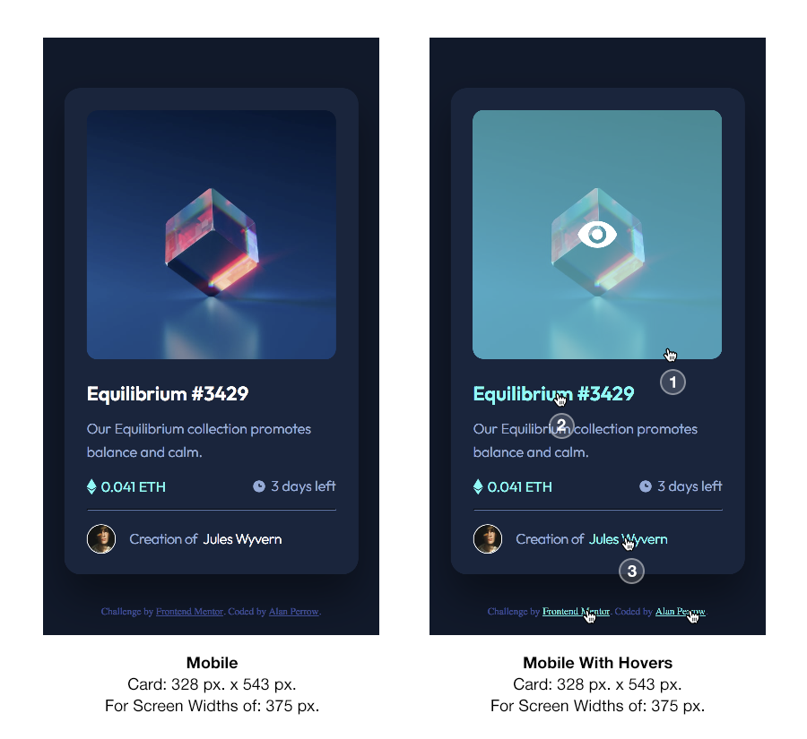
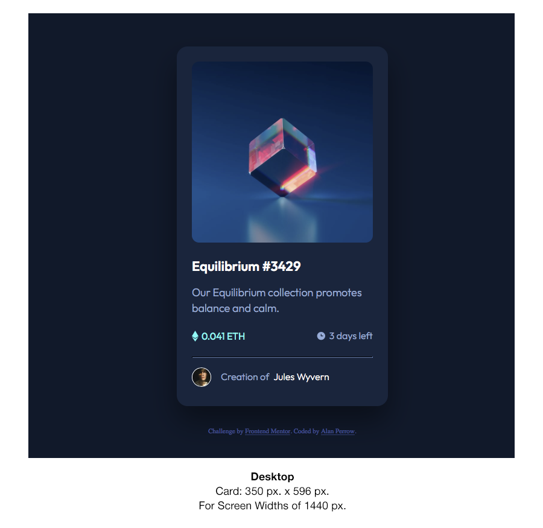

# Frontend Mentor - NFT preview card component solution

This is a solution to the [NFT preview card component challenge on Frontend Mentor](https://www.frontendmentor.io/challenges/nft-preview-card-component-SbdUL_w0U). Frontend Mentor challenges help you improve your coding skills by building realistic projects. 

## Table of contents

- [Overview](#overview)
  - [The challenge](#the-challenge)
  - [Screenshots](#screenshots)
  - [Links](#links)
- [My process](#my-process)
  - [Built with](#built-with)
  - [What I learned](#what-i-learned)
  - [Continued development](#continued-development)
  - [Useful resources](#useful-resources)
- [Author](#author)
- [Acknowledgments](#acknowledgments)

## Overview

### The challenge

Users should be able to:

- View the two optimal layouts depending on their device's screen size, as listed here.
  1. A mobile layout that maintains its size from 375px. – 1224px.
  2. A desktop layout that maintains its size 1225px. – infinity and beyond.
- See the hover states for the three interactive elements, as described below.
  1. On hover the main NFT cover image of the transparent cube will show a cyan color overlay with an "eye ball" icon overlaying it.
  2. On hover the main heading text "Equilibrium #3429" will change from white to cyan.
  3. On hover the creator's name text "Jules Wyvern" will change from white to cyan.
- Additional non-required hovers
  - Credit line text: Frontend Mentor change from white to cyan.
  - Credit line text: coder's name change from white to cyan.

  <br>

### Screenshots





The two screenshots above represent this solution as viewed in the Safari web browser on the Mac. Both screenshots are at 100%. It is interesting to note the card sizes differ between the mobile and desktop views; hence, the mobile view is only slightly smaller than the desktop view. This solution's code and layout reflects that difference at the proper view sizes required for this challenge (375px. and 1440px.).

The mobile view is present from 375px. – 1224px. and then the desktop view engages at 1225px. to infinity and beyond…


### Links

- Solution URL: [NFT Preview Card Challenge](https://stosh12.github.io/nft-preview-card/)
- Live Site URL: [NFT Preview Card Challenge](https://stosh12.github.io/nft-preview-card/)


## My process

I followed pretty closely the readme instructions that originally came with this challenge. I began with coding the HTML first mostly and then added my styles in separate CSS file. Then as things became a little more challenging and problem solving was needed I would switch back between both.

I started with the mobile view first and then worked forwards to the desktop view. The desktop view engages media query at 1225px.

To keep images, graphics and text aligned as best as I could, I used a screened back template image of each design mockup placed within the main card holder divs of both the mobile and desktop views. This way, I could adjust margins, text, images and border sizes to get a solution that was almost right on to the design mockups, which were provided.

I used VSCode as my coding application of choice with its "Live Server" extension and previewed my layout within Apple's Safari web browser on the Mac and then later tested it within the Chrome web browser on the Mac. Both rendered the same results. While coding semantic HTML5 markup was used as best as one could on this project. Since, it was a card only, the main semantic elements that were used were the "section" and the "h1" tags.

Additionally, list items were used for ETH value and days left items with display of flexbox on the "ul" element to get these two items to move to the left and right sides of the card.


### Built with

- Semantic HTML5 markup
- CSS custom properties
- Flexbox
- CSS Grid
- Mobile-first workflow
- A CSS pseudo-element
- VSCode
- Apple Safari and Google Chrome Web browsers

### What I learned

While creating the mouse over or hover overlay for the NFT image, I learned more about CSS blending modes and adding multiple background images to a single CSS selector. My first attempt at creating this overlay involved using the screen blending mode for the background image of the NFT cube to create the appearance of a cyan overlay with the eye, another background image, in the center on top. Everything worked out fine except the overlay seemed to have a little more saturation and brightness in it than expected relative to the NFT cube. At this point it looked like using the normal blending mode at 50% would be the best solution; but one can't create a semi-transparent or transparent overlay in normal mode; so, I had to go another route.

Hence, I moved to using a CSS pseudo-element with a hover state added to create this overlay with a background in normal mode. Here, I could adjust the alpha channel of the background color to 50% to get the transparency I needed where the saturation of the NFT cube with the overlay was closer to what was present in the mockup. This was a little challenging; but seemed to workout in the end. Show below is the HTML and CSS code I used for both methods.
<br>

**HTML that contains the div element (equilibrium-image) that holds NFT cube image**

```html
<div class="equilibrium-image-holder">
  <a href="#"><div class="equilibrium-image"></div></a>
  </div>
```
<br>

**CSS pseudo-element**
This is the CSS for the pseudo-element cyan background color overlay over the NFT cube image, which is used in the final solution:

```css
.equilibrium-image {
    position: relative;
    width: 100%;
    height: 100%;
    background-image: url("../images/image-equilibrium.jpg");
    background-size: cover;
    border-radius: 12px;
}
.equilibrium-image:hover::before {
    content: "";
    position: absolute;
    top: 0px;
    right: 0px;
    bottom: 0px;
    left: 0px;
    background-image: url("../images/icon-view.svg");
    background-repeat: no-repeat;
    background-position: 50%;
    background-color: hsla(178, 100%, 50%, .5);
    border-radius: 12px;
}
```
<br>

**CSS background blending mode**
This is the CSS before I finally chose to us the pseudo class. This is based on the background blending mode of screen. Also, it uses two background images, which are the NFT cube image and the eye icon.

```css
.equilibrium-image {
    position: relative;
    width: 100%;
    height: 100%;
    background-image: url("../images/image-equilibrium.jpg");
    background-size: cover;
    border-radius: 12px;
}
.equilibrium-image:hover {
    position: relative;
    background-image: url("../images/image-equilibrium.jpg"), url("../images/icon-view.svg");
    background-color: rgba(0, 128, 123, 1);
    background-blend-mode: screen;
    background-repeat: no-repeat;
    background-size: cover, 18%;
    background-position: center;
    border-radius: 12px;
}
```

### Continued development

I may be working on more Frontend Mentor projects in the future to help enhance my coding skills. Also, I plan to be learning more about JavaScript.

### Useful resources

- [coder coder! — How to change background-image opacity in CSS without affecting text | HTML/CSS](https://coder-coder.com/background-image-opacity/) — This reference helped me with pseudo-element background overlays.
- [W3C CSS background-blend-mode Property](https://www.w3schools.com/cssref/pr_background-blend-mode.asp) — This reference helped me with background image blending modes.
- [W3C CSS Multiple Backgrounds](https://www.w3schools.com/css/css3_backgrounds.asp) — This reference helped setting the parameters for multiple backgrounds independently within on CSS selector. This would include parameters like, background size and repeats.


## Author

This challenge was coded by Alan Perrow!

- Frontend Mentor - [NFT Preview Card Challenge](https://www.frontendmentor.io/challenges/nft-preview-card-component-SbdUL_w0U)


## Acknowledgments

My thanks to those whose help I got from the **"Useful resources"** section references within this readme document! Thank you for publishing your Web knowledge on the internet for all to see!

